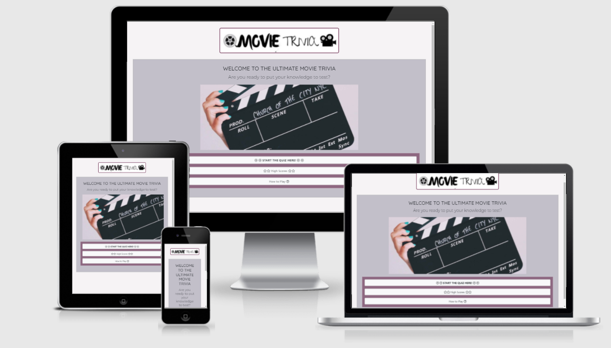
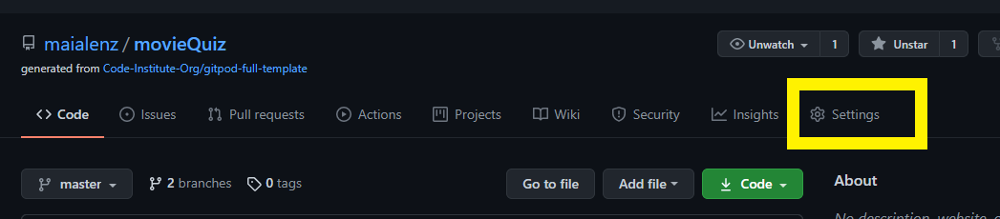
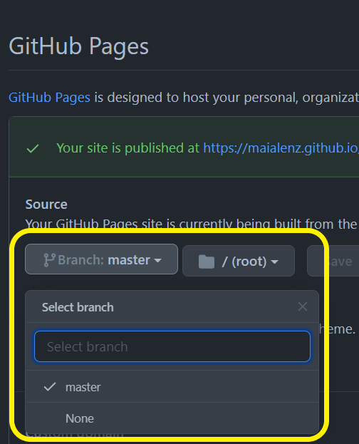
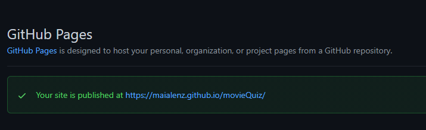
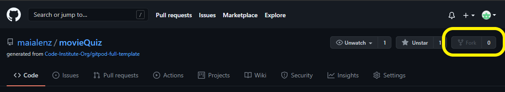
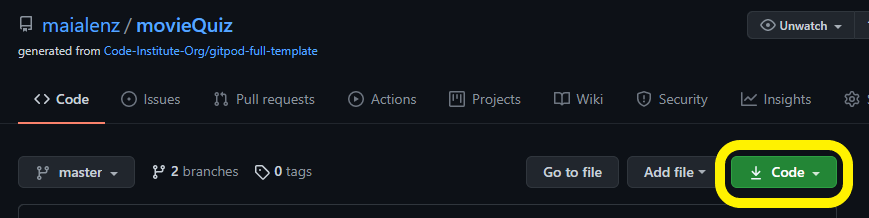
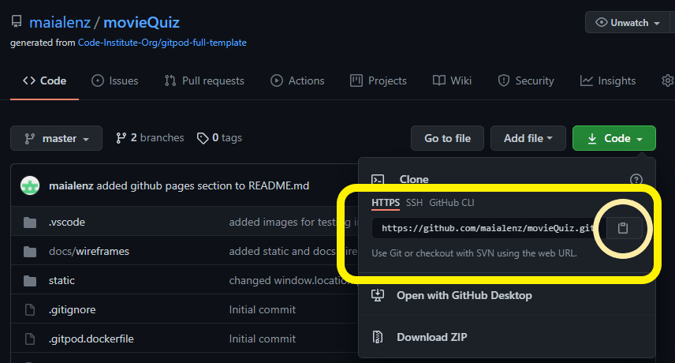
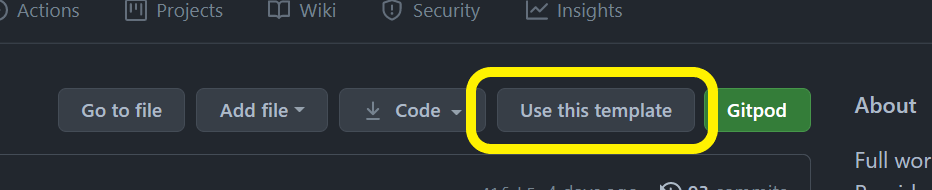
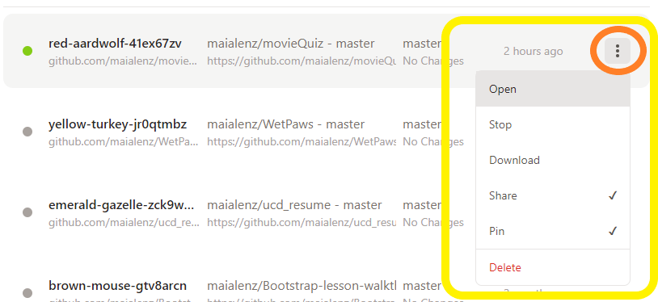

# **The Ultimate Movie Quiz**</center>

## Milestone 2 Project - Interactive User-Centric Frontend Development

### [View live project here](https://maialenz.github.io/movieQuiz/)



## Overview

This website is an entertaining quiz game for those who want to have fun testing their general knowledge about the film industry, by answering a series of questions and trying to beat their own scores.

The website will be responsive and accessible on all devices, but it's optimized to be played on a medium/large screen. The website will be visually minimal to focus on the questions and interactive. It will be aimed for people who want to have some fun and learn something new while playing.

---

## Table of Contents

1. [UX](#ux)

- [User Stories](#user-stories)
- [Game goals](#game-goals)
- [User Centered Design](#user-centered-design)
  - [Strategy plane](#strategy-plane)
    - [User needs](#user-needs)
    - [Technical capabilities](#technical-capabilities)
  - [Scope plane](#scope-plane-|-trade-offs)
  - [Structure plane](#structure-plane)
  - [Skeleton plane](#Skeleton-plane)

2. [DESIGN](#design)

- [Color scheme](#color-scheme)
- [Typography](#typography)
- [Imagery](#imagery)
- [Logo](#logo)

3. [FEATURES](#features)

- [Existing Features](#existing-features)
- [Features left to implement](#features-left-to-implement)

4. [TECHNOLOGIES USED](#technologies-used)

- [Syntax](#syntax)
- [Frameworks, Libraries & Programs](#frameworks-libraries-&-programs)

5. [TESTING](#testing)

- [Testing document](TESTING.md)

6. [DEPLOYMENT](#deployment)

- [GitHub Pages](#github-pages)
- [Forking the repository](#forking-the-GitHub-repository)
- [Making a local clone](#making-a-local-clone)

7. [CREDITS](#credits)

8. [REFERENCES](#references)

9. [ACKNOWLEDGEMENTS](#acknowledgements)

## UX

### **User stories**

- As a user I want to:

    - Be able to have the game rules available.
    - Be able to start the quiz by clicking a single button.
    - Be able to choose my answer from a multiple choise answer to each question.
    - See my score as I progress through the game
    - Know which question I am currently on
    - Get a feedback with the total score and the option to retake the quiz or go to the main menu.

### **Game goals**

This is a simple "trivia" game to test the general knowledge about movies and some facts about the industry. The player needs to choose one answer from the given multiple choice. If the answer is right, the user will get a score added in the score bar. If the answer is incorrect, the user won't be able to change the answer and there won't be any points added. The user won't be able to see the right answer as this will give them the choice to retake the quiz and beat their top 5 highest scores. 

Once the player has pressed on the chosen answer, they'll have a second to see if their result is correct or incorrect, and the next question will load automatically. At the end of the game, all the correct answers will be added and the player will get the total result.

This quiz has been created for entertaiment purposes using a public [Trivia API](https://opentdb.com/).

---

## USER CENTERED DESIGN

### **Strategy Plane**

- #### User needs

There’s something satisfying about being able to recall and guess correctly and test the knowledge and test ourselves. This is why quizzes in general are so popular.

By answering the questions, the user will be able to find entertainment and enjoyment by answering questions about movies and by doing so, learn some facts that they did not know before.


- #### Technical capabilities

  - To use this site the user needs to have access to some internet connection within their chosen device.

  - They also need to have basic understanding on how to select and navigate the page.

  - This page can be done with Bootstrap framework to create a structure and implement sections that the user needs. The quiz will be kept separated in 3 main sections (homepage, game and end) but easyly accessible from the homepage. The High scores ranking will be accessible from the main page and the user will input their username on the last page once the quiz ends.

---

### **Scope plane | Trade-offs**

- **Features within the design plan with highest priority:**

  - Minimal but appealing homepage 
  - Start button easily accessible from
  - Instructions for the user on how to play the game
  - Tracker for the questions and score
  - Final page with the final result


- **Lower priority features that may not be included in the initial release of the website:**

  - Responsive navigation bar.
  - Countdown timer for the questions
  - Different levels of difficulty.
  - To give the feedback with the correct answer in the answer is incorrect
  - Populate questions by using a trivia API.

---
### Structure Plane

- The structure of the site will be layed out in four pages.The landing page (homepage) and three clickable buttons (Start Quiz, High Scores and Instructions).

- The Start Quiz will retrieve questions from an API and it's set to easy so the user can enjoy answering the questions without the added difficulty.

- If the questions take longer to load, the user will be presented with a loader as a sign that something is happening

- 

- The score count will be represented at the top of the page (above the footer).

- To ensure the users experience when completing the quiz the end page will show the final score, as well as two buttons allowing the user to go back to the main page or retake the same quiz.

- The footer will contain all the inportant some information about the creator of the quiz.

---

### Skeleton Plane

- [Mobile Wireframe](docs/wireframes/Mobile.png)
- [Ipad Wireframe](docs/wireframes/Ipad.png)
- [Desktop Wireframe](docs/wireframes/Desktop.png)

## DESIGN

The design of the quiz was created to be as simple but pretty as posible, not to distract the customer with too many color schemes and trying to bring the focus to the picture related to the question.

### **Colors**

The colors used in this project are very simple, to keep a minimalistic and tidy quiz, as well as keeping the color contrasts the highests posible to facilitate the screen readers and make this quiz accessible to all.

The colors chosen are combinations of: pale/light and darks purple, white and shades of grey. The color were found using [Coolors](https://coolors.co/).

Some of the colors used in this project are: 

- rgb(87, 15, 55): this color was used as the main color, but I've added opacity to make different shades of it.
- rgba(173, 169, 183, 0.7): used as a background color.
- #fff: used as button background color.
- rgb(181, 228, 140) for correct answers.
- rgb(229, 56, 59) for incorrect answers.

---

### **Typography**

The fonts used for the site were taken from [Google Fonts](https://fonts.google.com/). To make sure the questions are represented on a fun way but easy to read, it was decided to use simple but and consistent fonts previously used in other projects within Code Institute like:

- "Montserrat alternates": to create fun and attractive fonts as well as drawing attention to the most important information.
- "Quicksand": for more suttle but attractive font. It's clean and simple, making this a pleasant font to look at.
- Sans-serif: used as a fallback font in cases there is an issue when importing fonts or the browser does not support these.

---
### **Imagery**


- The website will try keep a balance between aesthetic style and fun without overwhelming the user and slowing the loading time of the page, so it was decided to only include one image at the beginning of the site (homepage) as a welcome to the user and introduction to the theme of the trivia/quiz.

- I thought that any other images (end page and highscore page) where out of place, as the user would only want to see the important part: their score and end results.

- Althought in the beginning I wanted to include an image for every question I created, as I decided to use an API instead of the hard coded questions, this wasn't a priority for this release, so I decided to leave this for future releases.

---
### **Logo**

- The favicon was created using [Favicon.io](https://favicon.io/favicon-converter/) and the logo used to create it was created using an online application called [Canva](https://www.canva.com/). It represents a clapperboard nodding the film industry and the main subject of the game. The use of the favicon makes it easier to recognize the game tab in between others that the user might have had already opened.

- The logo's design represents the film industry and is easily recogniseable by users as a movie orientated game.

---

## FEATURES

### Existing Features

- The site will consist of four pages: homepage, the game page, the end page and the highscores page. Based on the user selection, the user will be taken to the respective page. The site will be responsive for most screen sizes, but it's best enjoyed on medium to large size screens.

- All buttons and links will be styled with hovering effects to invite the user to click on them.

- The logo will stay static along the game to give the website consistency.

- **Homepage:** 

  - Header: An area to introduce the user to the game
  - Image: to set the theme of the quiz visually
  - Controls Section: under the hero image there will be a section highlighted on another darker color with lighter buttons to point the user to the contol section:
    - Start the game Button: 'Start' button to hint the user to click on it to Start the quiz. Clicking this will direct the user to the game.
    - High Score Button: a button directing the user to the top 5 scores page which are saved on the end page. Clickin this button will direct the user to high scores page.
    - A modal button which contains the instructions of the game. clicking this button will open a modal explaining the user the game rules.

- **Game:** 

  - A section above the displayed question with two areas: the area on the left counts the current question with a progress bar to make the counter more appealing and easier to visually see it. The area on the right display the added score when the user answers the question correctly. 
  - There will be 10 questions on display. The questions have been created thanks to the use of an [open Trivia API](https://opentdb.com/). 
  - If the API fails to load, the user will be presented with an error message prompting them to reload the page and try again.
  - The user will be given 4 multiple choice answers. The user has to click on the answer. The answer will turn red or green depending if the answer is correct or incorrect. The user won't be able to see right answer if the choice is incorrect, as the intention is to be able to retake the quiz and try to beat their own score,
  - The question will automatically load a second after the user has made the selection, so there will not be any buttons for the user to jump into the next question manually. This is to make the user's experience nicer, by clicking less.
    
- **End:** This will be the feedback page.
  - There will be a section with the score summary, which will be updated as the user answers correct questions. As each question is 10 points the maximum amount of points the user can get is 100 points.
  - The save button will be disabled until the user starts typing on the input area. When the input is filled the save button will be active.
  - Under the score there will be a input gap whith username as a placeholder where the user will be able to input their name and save it. The top 5 saved scores will be shown on the Highscore page accessible from a button placed on the homepage
  - Two call to action buttons with color changing hover feature allowing the user to return to the main page or to retake the same quiz .

---

### Features left to implement

- The option to choose a theme or category: although this was part of the first planning, the implementation of the API created the issue of separating the available questions on themes, as this particular API does not separate the available film questions on different categories or themes. I decided to leave this feature for future releases because the implementation of this would mean that I would have to change the main subject of the trivia. In future releases it is expected to change the main subject of the trivia from 'Movie Quiz/Trivia' to 'Ultimate Trivia' with the posibility of choosing themes/categories and selecting the subject that the user would like to be quized on.

- The posibility of choosing different difficulty: in the first release, there won't be any option to select the difficulty and complexity of the questions, but in a future release there would be three different options for the user to select (easy, medium, hard)

- A countdown timer: Due to the learning curve I had to endure to create this application, I decided to leave the countdown out for the time being, as I wanted to focus on learning how to implement the most important functionalities for the enjoyment of this game.

- A restart button under the questions on the game: As the first release of the application, it was decided to leave the restart button for the end of the quiz, but for future releases it's expected to add a restart CTA button under the questions so the user would be able to restart the quiz. In this release, the user will only be able to restart the quiz/trivia at the end of the quiz, when the end.html page loads.

- A confirm modal: when the user clicks on the restart button under the questions on future releases, the user would be presented with a modal to confirm that the user will be sent to the start of the quiz and will lose all progress achieved to that point. This will be a feature to improve user experience and to make sure the user doesn't accidentaly lose all the points collected to that point.

- Navbar and footer: as this is a simple quiz application, it was decided not to include any navbars or footers as they were thought to be irrelevant for this first release. For future releases, as the application increases on themes/categories, difficulty... it's expected to contain a responsive navbar for better UX and easier access to subcategories and dropdown buttons. The same way, the footer would contain a email and contact information so users can contact the creator and send feedback and/or proposed questions to include on the quiz. 

---

## TECHNOLOGIES USED

### Syntax

- HTML5:
  - HTML5 is a markup language used for structuring and presenting content on the internet.
- CSS:
  - Cascading Style Sheets (CSS) is a style sheet language used for describing the presentation of a document written in a markup language such as HTML
- Markdown (for README.md, REFERENCES.md and TESTING.md)
- JavaScript: 
  - Javascript is a lightweight, interpreted, object-oriented language with first-class functions, and is best known as the scripting language for Web pages, but it's used in many non-browser environments as well.

---

### Frameworks, Libraries & Programs

- [Balsamiq](https://balsamiq.com/) 
  - Used to create wireframes for each website page on various devices and screen sizes.

- [Font Awesome](https://fontawesome.com/)
  - Used to display icons 

- [Bootstrap](https://getbootstrap.com/) with [JQuery](https://jquery.com/)
  - was used for responsiveness using the grid system
  - jQuery was used alongside the Bootstrap library to create the rules modal.

- [Google Fonts](https://fonts.google.com/)
  - Used to import the two fonts used throughout the site 'Quicksand' and 'Montserrat Alternates'.

- [Hover.css](https://ianlunn.github.io/Hover/)
  - A library with ready to use hover effects. It was used for all the links and buttons. The effect used was hover glow.

- [GitHub](https://github.com/)
  - Used to host the entire repository for the project.

- [GitHub Pages](https://pages.github.com/)
  - Used to host the live version of the website.

- [GitPod](https://www.gitpod.io/)
  - The code editor used to build the entire project.

- [TinyPNG](https://tinypng.com/)
  - Used this to compress the image used on the website to decrease the file size.

- [Favicon](https://favicon.io/)
  - Used to generate the websites favicon logo of various sizes for different devices.

- [Am I Responsive](http://ami.responsivedesign.is/)
  - A tool to check how the website appears and the functionality on various devices. The mockups on this document was generated with this tool.

- [Responsinator]()
  - Similar to Am I responsive this is a web based application that allows a website to be checked an a large amount of devices in portrait and landscape view.

- [W3C Validator HTML](https://validator.w3.org/) & [W3C Validator CSS](https://jigsaw.w3.org/css-validator/)
  - Both of these were used to test all the code for the project whilst working and for the finished website to check for valid HTML and CSS.

- [JSHint](https://jshint.com/)
  - This is a tool used to detect errors or potential problems within Javascript code, it was used to test and validate all Javascript written for this project.

- [BrowserStack]()
  - This application was used to test the functionality and appearance of the project on all main browsers.

- [Unsplash](https://unsplash.com/)
  - used to get good quality pictures used as hero images and gallery

- w3schools
  - used to refresh the lessons learned in the course in a summed up way

- Stack overflow
  -to find solutions to problems and bugs I encounter during the creation of the website

- [Canva](https://www.canva.com/)
  - used to create the logo image
---

## TESTING 

Find the Testing document [here](TESTING.md)

## DEPLOYMENT

### GitHub Pages

This project was built using the [GitPod](https://www.gitpod.io) environment, specifically in the cloud

1. To start using the new environment, first a new repository was created in GitHub called [movieQuiz](https://github.com/maialenz/movieQuiz)
2. All the commits and pushes made during the building process were made very often to keep the project save and updated.

The project was deployed using [GitHub Pages](https://pages.github.com/) using the following steps:

1. Log in to [GitHub](https://github.com/join/get-started) and locate the [GitHub repository](https://github.com/maialenz/movieQuiz)

   - You can also find it by seaching maialenz/movieQuiz on the [GitHub](https://github.com/) seach-bar.

2. Below the repository title at the top, find the "Settings" button on the horizontal or dropdown (small screens) menu



3. Scroll down the Settings page until you locate the "GitHub Pages" section.

4. Under the "Source" title, click on the dropdown button called "None" and change the source to "Master Branch".
   

5. The page will automatically refresh

6. When the loading is finished, scroll back down to the GitHub pages section where you will find the deployed [link](https://maialenz.github.io/movieQuiz/) to the website.
   

---

### Forking the GitHub repository

It is posible to copy and edit this project by any user without changing the repository on the original GitHub account. This can be done by forking the repository by following the following steps (Forking will only make a copy of the original project, so any changes won't affect the original):

1. Log in to [GitHub](https://github.com/join/get-started) and locate the [GitHub repository](https://github.com/maialenz/movieQuiz)

   - You can also find it by seaching maialenz/movieQuiz on the [GitHub](https://github.com/) seach-bar.

2. Below the repository title at the top, above the "Settings" button on the horizontal menu and under the user's profile logo, locate the "Fork" button and click on it.
   

3. You will have made a copy of the whole repository in your own GitHub account.

4. To share the changes/edits you have made to improve the original project with the owner, you can submit a pull request.
   Find the details to do so following this [link](https://docs.github.com/en/github/collaborating-with-issues-and-pull-requests/creating-a-pull-request-from-a-fork).

---

### Making a Local Clone

1. Log in to [GitHub](https://github.com/join/get-started) and locate the [GitHub repository](https://github.com/maialenz/movieQuiz)

   - You can also find it by seaching maialenz/movieQuiz on the [GitHub](https://github.com/) seach-bar.

2. Above the repository files and to the left of the green "GitPod" button, locate the "Code" or "download" button and click on it.
   

3. To clone the repository using HTTPS copy the link on display (you can click on the clipboard to copy it faster).
   

4. If you are working on a desktop application, follow the documentation found on number 5. For cloud based, open your own terminal in GitPod or your preferred IDE (we will be using Gitpod).

    - For this project, we created a new workspace environment in GITPOD by using Code Institute's [Full Gitpod template](https://github.com/Code-Institute-Org/gitpod-full-template). To open it, just click on the Use this template button and all the necessary tools will be added to the work environment without the need of manually installing them. It takes a few minutes to load.
  

5. If you use GitHub desktop follow the steps documented [here](https://docs.github.com/en/github/creating-cloning-and-archiving-repositories/cloning-a-repository#cloning-a-repository-to-github-desktop).


#### Gitpod workspace after copying the HTTPS clone link

1. Change the current working directory to the location where you want the cloned directory to be made.

2. In the terminal type `git clone` and then paste the URL copied on step 3

```
$ git clone https://github.com/YOUR-USERNAME/YOUR-REPOSITORY
```

3. Press Enter. This will create your local clone.

```
$ git clone https://github.com/YOUR-USERNAME/YOUR-REPOSITORY
> Cloning into `CI-Clone`...
> remote: Counting objects: 10, done.
> remote: Compressing objects: 100% (8/8), done.
> remove: Total 10 (delta 1), reused 10 (delta 1)
> Unpacking objects: 100% (10/10), done.
```

4. To open a preview port within your own local workspace type within gitpod, enter the following command on the terminal:

```
$ python3 -m http.server
```

5. Once your Gitpod workspace is created, only open the workspace from Gitpod Workspaces itslef (https://gitpod.io/workspaces/), and not from GitHub Gitpod button (Only use this button once at the very begining when creating a new workspace)
   

---
## CREDITS

As this has been the first project using a new programming language like JavaScript, I found this second milestone project very challenging. Without any previous programming knowledge, I found myself using a great variaty of documentation and tutorials to revisit the lessons learnt during this module with Code Institute. 
This project has really put my research and understanding skills to the test, but it has been a great learning curve, and all the tutorials I followed really helped with this.

### REFERENCES

- Previous to deciding to create separate pages for each game section, I learned how to fade questions from this post on [StackOverflow](https://stackoverflow.com/questions/15348725/how-to-make-quiz-questions-appear-one-at-a-time-in-javascript)

- Learned how to use spread operators on [MDN docs](https://developer.mozilla.org/en-US/docs/Web/JavaScript/Reference/Operators/Spread_syntax)

- understood the difference between JavaScript ES5 & ES6 thanks to this article by [Jay Sridhar](https://www.makeuseof.com/tag/es6-javascript-programmers-need-know/)

- Learned about the arrow syntax in [w3schools](https://www.w3schools.com/js/js_arrow_function.asp), [sitepoint](https://www.sitepoint.com/es6-arrow-functions-new-fat-concise-syntax-javascript/), [javascript tutorial](https://www.javascripttutorial.net/es6/javascript-arrow-function/) & following this video by [the Coding train](https://www.youtube.com/watch?v=mrYMzpbFz18)

- My code was highly influenced by these tutorials
  - By [James Q Quick tutorial](https://www.youtube.com/watch?v=u98ROZjBWy8&list=PLDlWc9AfQBfZIkdVaOQXi1tizJeNJipEx)
  - [Pablo Monteserín](https://www.youtube.com/watch?v=OH8rPQlZ_CA)
  - [Re-On Media](https://www.youtube.com/watch?v=J-IVrJa_k2s) & [Re-On Media](https://www.youtube.com/watch?v=bkvLa8BI9zc)

- Learned how to fetch from [MDN docs](https://developer.mozilla.org/en-US/docs/Web/API/Fetch_API/Using_Fetch)

- I found this very helpful: how to import json files 
  - [Amit Diwan](https://www.tutorialspoint.com/how-to-import-local-json-file-data-to-my-javascript-variable) 
  - [eureka! community](https://www.edureka.co/community/83684/how-to-read-an-external-local-json-file-in-javascript)
  - [eureka! community](https://www.edureka.co/community/82336/how-to-load-local-json-file)

- Although at the end I decided not to include hard coded questions, I learned how to import the json file with the help of this article [Stefan Judis](https://www.stefanjudis.com/snippets/how-to-import-json-files-in-es-modules-node-js/)

- Took the idea to include the Open Trivia API from [Benjamin Siegel](https://www.youtube.com/watch?v=SgJ_femmsfg&t=615s)

- Understood .splice thanks to [Ania Kubów](https://www.youtube.com/watch?v=E01cd5ZTQMU&list=RDCMUC5DNytAJ6_FISueUfzZCVsw&index=22)

- Followed this tutorial to help me understand the structure of the quiz [Yaphi Berhanu](https://www.sitepoint.com/simple-javascript-quiz/)

- Borrowed the code for the loader from [w3schools](https://www.w3schools.com/howto/howto_css_loader.asp)

- Learned more about fetch from [John Linatoc](https://medium.com/@johnwadelinatoc/manipulating-the-dom-with-fetch-7bfddf9c526b)

- Borrowed idea for how to remove hover on touch devices from [Stefan Judis](https://www.stefanjudis.com/today-i-learned/the-hover-media-query-can-help-to-remove-hover-styles-on-touch/)

- Learned about routing and relative URL paths on [Stack Overflow](https://stackoverflow.com/questions/1655065/redirecting-to-a-relative-url-in-javascript)

- Fixed my first json file following this post on [Stack Overflow](https://stackoverflow.com/questions/44587340/javascript-fetch-not-reading-json-file)

- This tutorial helped me with the highscore section: [Developerdrive Staff](https://www.developerdrive.com/html5-javascript-gem-game-with-saved-scoreboard/)

---

### Images

- Thank you to [Jon Tyson](https://unsplash.com/@jontyson) for the picture used on the homepage found in [unsplash](https://unsplash.com/)
