# **TESTING DOCUMENT**

## **The Ultimate Movie Quiz**</center>
## Milestone 2 Project - Interactive User-Centric Frontend Development

### [View live project here](https://maialenz.github.io/movieQuiz/)

## OVERVIEW

This project was my first ever encounter with a programming language. As seeing from the wireframes and the commit history, I changed my mind a few times as I explored different options to tackle the javaScript side of the project.

Although I found the understanding of JavaScript confusing and difficult, the use of documentation and tutorias as well as the slack community (posts related to issues like mine), I managed to overcome the difficulties and make a responsive and interactive game.

From the very beginning I used Google Chrome Dev Tools to style and fix my code. I also installed LiveServer on the workspace to be able to see the changes and the console as I coded. This helped fix mistakes and error on real time as all the tool helped me see the results of my code on real time. 

Once finished, I tested my site on a two different phones, laptop, tablet and desktop as well as DevTools and different browsers manually.

## Table of Content

1. [USER STORIES](#user-stories-testing)
2. [VALIDATOR CHECKS](#validator)
   - [HTML](#html-validator)
     - Index.html
     - Game.html
     - End.html
   - [CSS](#css-validator)
     - style.css
     - game.css
     - highscore.css
   - [JSHint](#jshint-validator)
3. [LIGHTHOUSE TESTING](#lighthouse-testing)
   - Mobile
   - Desktop
4. [DEVICE RESPONSIVENESS](#device-responsiveness)
5. [BROWSER COMPATIBILITY](#browser-compatibility)
6. [BUGS](#bugs)
7. [BACK TO README.md](README.md)

## USER STORIES TESTING

### **User stories**

- Be able to have the game rules available:
    - This is posible thanks to a large clickable button on the main page in the control panel. 
    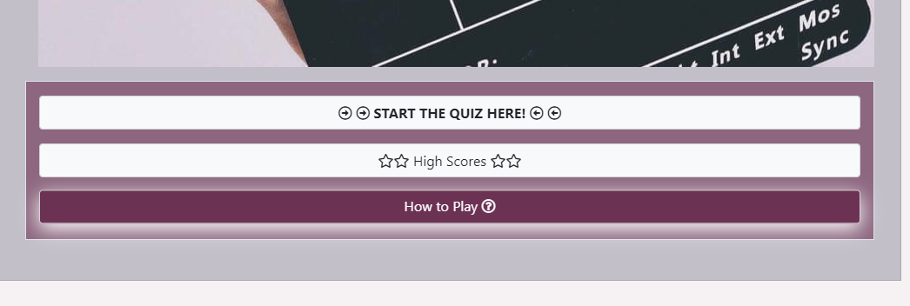

    - The user can easily see and find the button and when clicked on it, the modal including the rules to the game opens over the homepage. 
    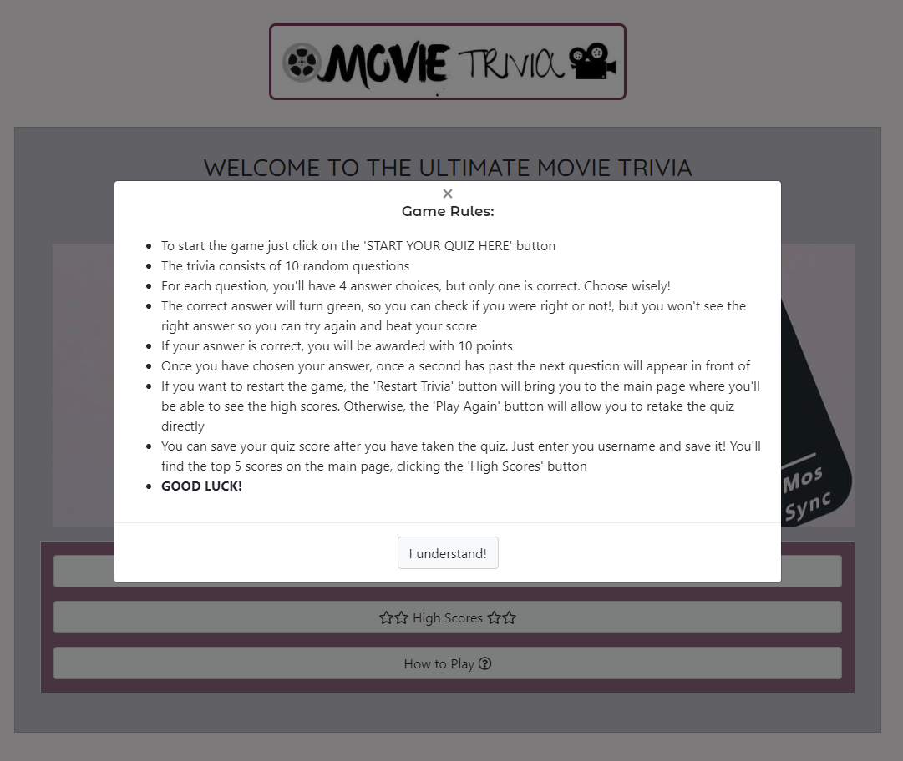

    - The user will be able to close the Rules window two ways: 
        - the x to close situated on the top of the Modal window
        - A button to close the Modal with the text 'Understood' to hint the user to click over it (this button hovers to hint the user to click over it)
    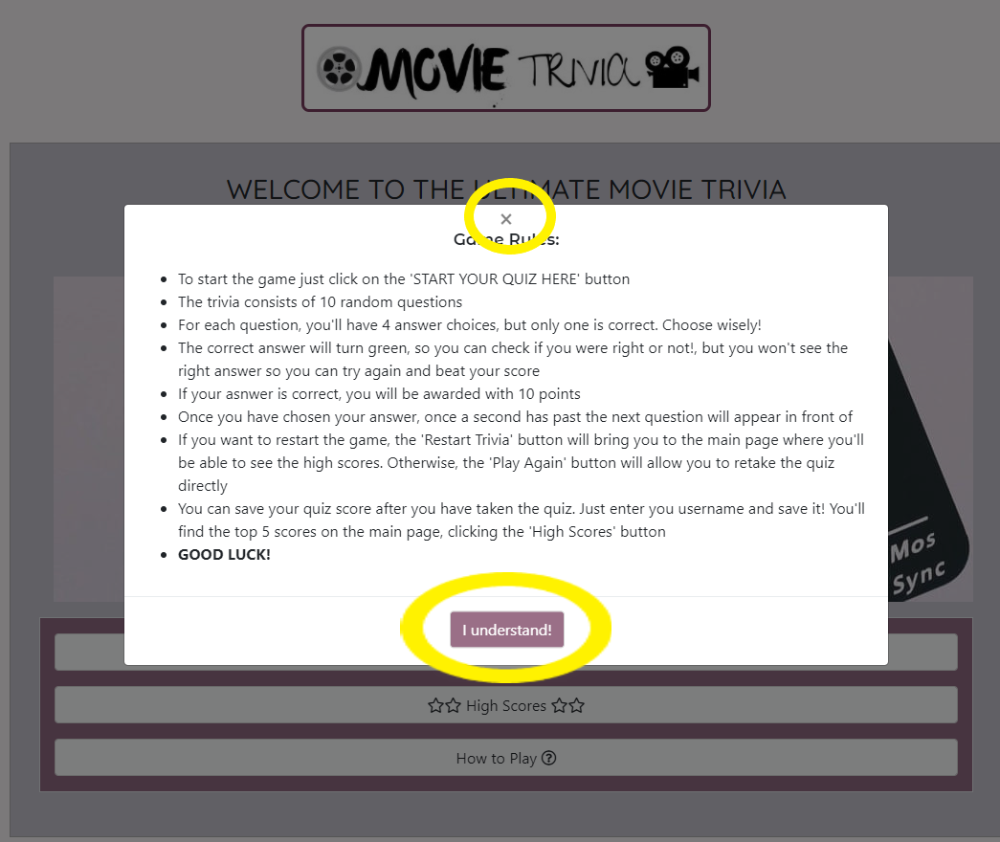

- Be able to start the quiz by clicking a single button:
    - As the Game rules, the user can easily find the Start button at the bottom of the screen, just below the hero image. The text inside the button has been capitalized to catch the user's eye and the arrow icons make it more visible. The button glows in a darker color when hovered over.
    

    - If the user wants to retake the quiz once they have finished it without going back to the homepage, they can do it so by clicking over the Play again button. The button glows in a darker color when hovered over.
    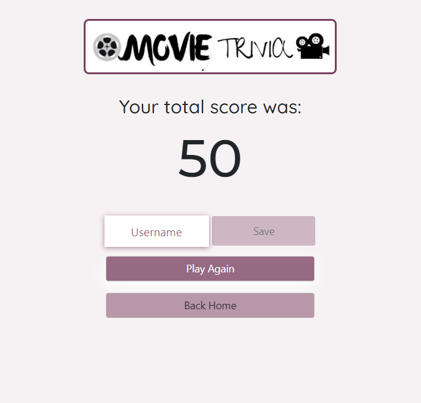

- Be able to choose my answer from a multiple choice answer to each question.
    - Each question has four options for the user to choose. They will be able to hover over the answers and in this release there is no timer so the user won't be preasured to make a choice
    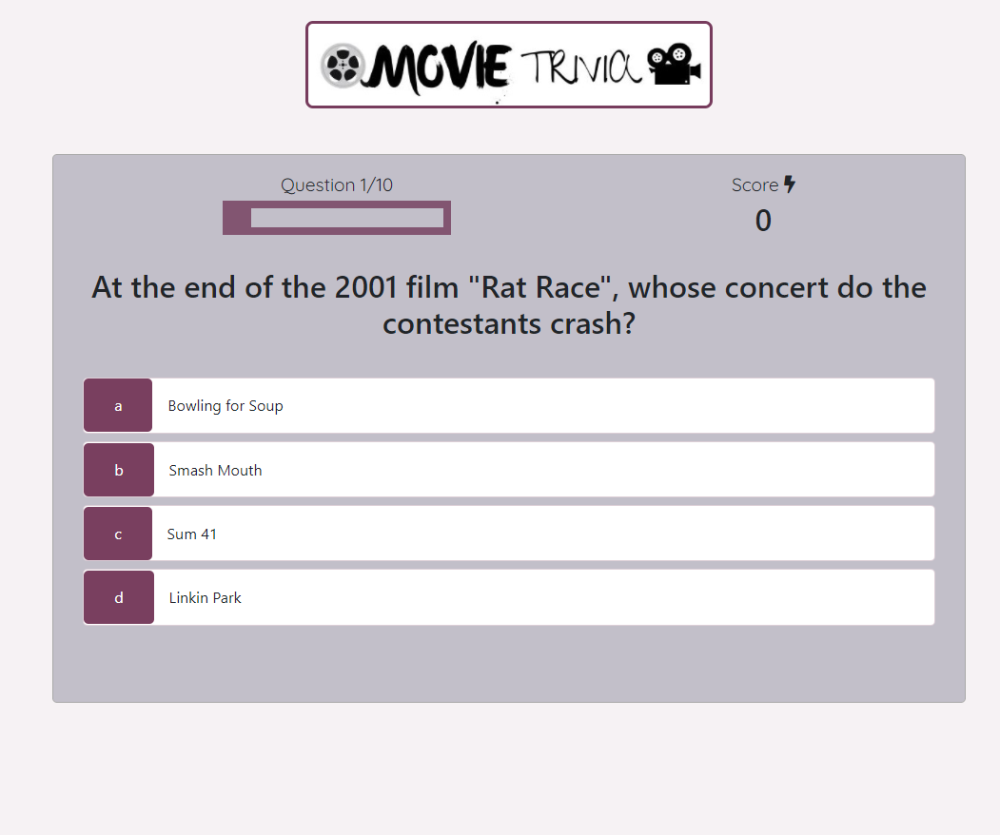

    - The question will load automatically once the user has answered the question
    - The answer chosen by the user will turn on red if the anwer to the question is incorrect. If the answer is correct, the answer will turn on green.
    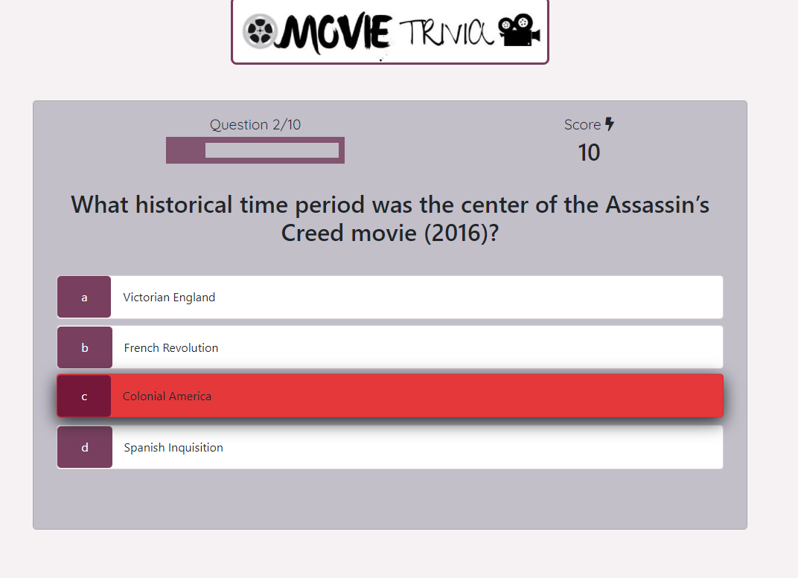
    

    - If the the loading of the fetched API questions take longer than usual, the user will be notified that the questions are loading with the representation of a loader
    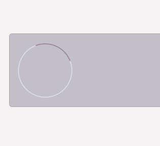

- See my score as I progress through the game:
    - The score count is situated on the top right, just above the question, so the user can easily identify the score count. 
    - To make it easy to understand, the score count has the word 'Score' on it.
    - When the user answers the question correctly, the score counter will increase by 10 points, the maximum possible of points being 100.
    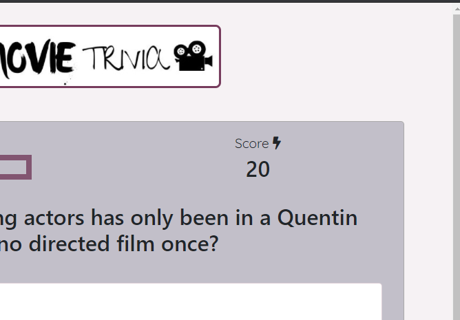
    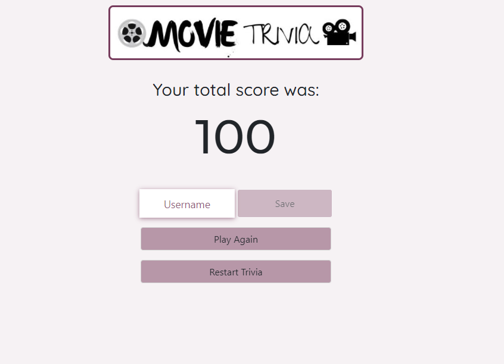

    - The user has the posibility to save the score by inputing their alias and clicking on 'Save'. The save button is disabled until the user starts typing on the input area. The top 5 highest scores will be saved on the High Score section. The user can see these by clicking on High Scores button on the main page.
    
    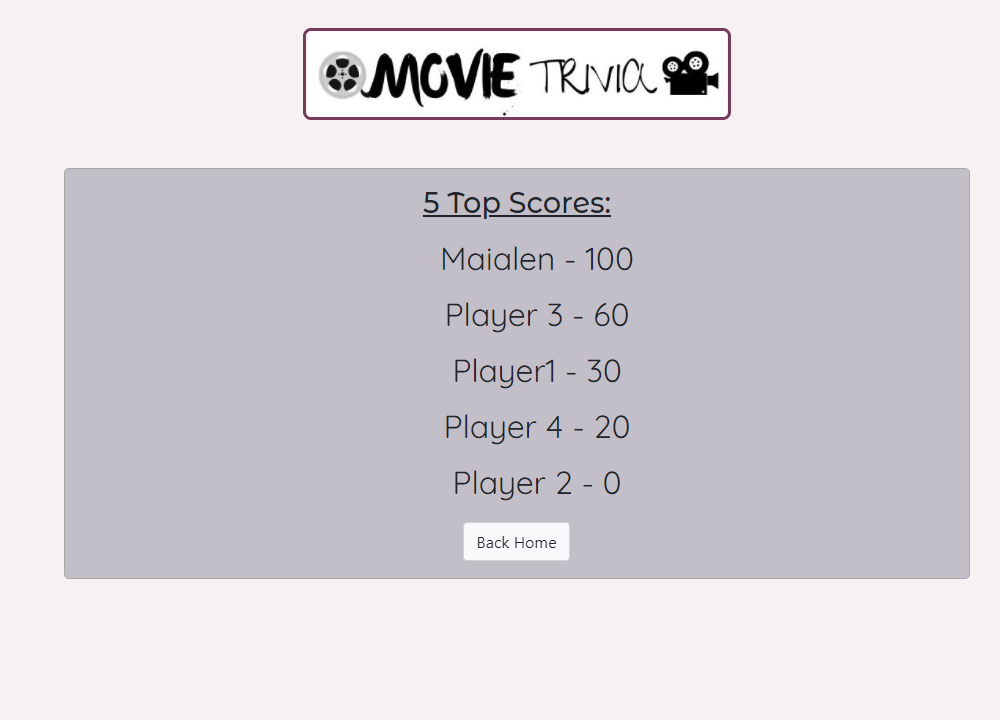
    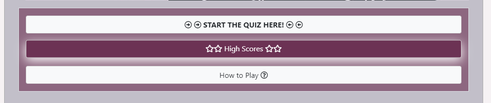

- Know which question I am currently on
    - The user can see the question they are currently answering on the top left corner, just above the question. 
    - To make it visually more appealing, the user can also see their progress on a progress bar. As the user answers questions, this bar will fill according to the amount of questions the user has answered.
    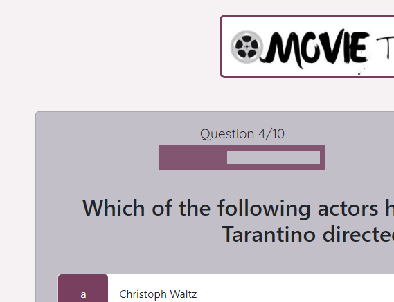

- Get a feedback with the total score and the option to retake the quiz or go to the main menu.
    - The user can see their total as they are answering the questions. At the end of the quiz, they will be shown the total points they received from the correct answers.
    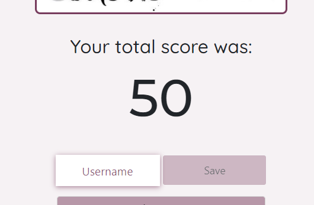
    - On the end page the user can decide if they want to retake the quiz again or they want to go back home. If the user clicks on Play again, the trivia will restart immediately. If the users clicks on Back Home, they will be taken back to the main page
    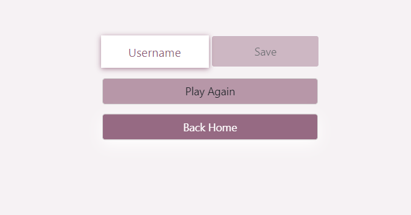

---

## VALIDATOR:

During the whole project, I continuously checked my code using [W3 Validator](https://validator.w3.org/#validate_by_uri) to make sure I fixed my code as I wrote it. At the end, I ran all the finished pages and made sure all the errors were fixed (see identified and fixed error list below).

As a css validator, I also used [w3 Validator](https://jigsaw.w3.org/css-validator/) to make sure it checked my style.css file to CSS level 3 + SVG standards.

(See passed validator results at the end of HTML and [CSS](#css-validator) sections.

### HTML VALIDATOR:

INDEX.html:

- Line 125: : Element biggest not allowed as child of element li in this context.
    - Removed Biggest element from line 125

GAME.html: 
- Line 63 and 71: Error: Duplicate ID hud-item.
    - Changed the id attribute and changed it for a class

- Line 87: Warning: Empty h2 heading.
    - I added a header which will be populated the fetched question from the API

END.html: 
- Line 49: Error: Attribute classs not allowed on element div at this point.
    - Fixed class typing error.

- Line 52: Warning: Empty heading.
    - Placed some text which will replace by the js end function.

---

HTML VALIDATOR RESULTS

- [Index.html Validator result](docs/testing/validator/index.html-w3-pass.png)

- [Game.html Validator result](docs/testing/validator/game.html-w3-pass.png)

- [End.html Validator result](docs/testing/validator/end.html-w3-pass.png)

- [Highscore.html Validator result](docs/testing/validator/highscores.html-w3-pass.png)

---

### CSS VALIDATOR

Results for CSS validator check:

- [Style.css Validator result](docs/testing/validator/style-css-validator-pass.png)
- [Game.css Validator result](docs/testing/validator/game-css-validator-pass.png)
- [Highscores.css Validator result](docs/testing/validator/highscores-css-validator-pass.png)

---

### JSHINT

- [End.js JSHint Validator](docs/testing/validator/end-jshint-validator.png)
    - Due to the use of arrow syntax, jshint considers saveHighScore funtion a variable. This is a function.
    - Removed unused variable MAX_HIGH_SCORES
    - Line 43: "Did you mean to return a conditional instead of an assignment?"
        - As this piece of code was not written by me and was introduced to fix an issue on the paths between github and gitpod, I decided to leave this warning untouched.

- [game.js JSHint Validator](docs/testing/validator/game-jshint-validator.png)
    - Line 93:  "Did you mean to return a conditional instead of an assignment?"
        - As this piece of code was not written by me and was introduced to fix an issue on the paths between github and gitpod, I decided to leave this warning unchanged.
    - Due to the use of arrow syntax, jshint considers startQuiz, getNewQuestion and incrementScore funtions variables. This functions are called using the arrow syntax. The repetition on the warnings is because JSHint has considered the callback functions variables too.

- [Highscores.js JSHint Validator](docs/testing/validator/highscore-jshint-validator.png)
    - No warning were found on this file

---

## LIGHTHOUSE TESTING

Using DevTool's Lighthouse tool, I checked all pages on mobile and desktop to make sure the scores were as high as I posibly could. Below can be found the results and scores the tests tests

(All tests were carried out the same way: I cleared cache data, opened new incognito page (Chrome and Edge), and reloaded and tested each page twice. Same procedure was used for mobile and web assessment)

Due to the simplicity of the game, the results of the lighthouse testing have come back very strong. Since there is very few heavy files, the site loads very fast and with no major issues, both on mobile and desktop, increasing like this the UX.

- **Mobile**

  - [Index.html Lighthouse test:](docs/testing/lighthouse/lighthouse-index-mobile.png)
  - [Game.html Lighthouse test:](docs/testing/lighthouse/lighthouse-game-mobile.png)
  - [End.html Lighthouse test:](docs/testing/lighthouse/lighthouse-end-mobile.png)
  - [Highscores.html Lighthouse test:](docs/testing/lighthouse/lighthouse-highscores-mobile.png)

- **Desktop**

  - [Index.html Lighthouse test:](docs/testing/lighthouse/lighthouse-index-desktop.png)
  - [Game.html Lighthouse test:](docs/testing/lighthouse/lighthouse-game-desktop.png)
  - [End.html Lighthouse test:](docs/testing/lighthouse/lighthouse-end-desktop.png)
  - [Highscores.html Lighthouse test:](docs/testing/lighthouse/lighthouse-highscores-desktop.png)

--

## DEVICE RESPONSIVENESS

I continuously tested the project on various devices from the very beginning. I mostly used Google Chrome DevTools, but as soon as I deployed the website (using GitHub Pages) I pushed my code very often to see the results of the changes in real time on my own personal devices (Samsung S8+, HP Envy 13", Samsung 5Se Tablet) and make sure the site was responsive on various viewports.

Apart from that, I used an online app by [Media Genesis](https://responsivedesignchecker.com/) as well as Google Chrome Developer tools to check responsiveness on those screens I did not have access to. The results of these testings are below (screenshots were taken of every decive available on DevTools and all pngs were combined together on a pdf).

- [Index mobile Test Results](docs/testing/device+browser-tests/index-DevTool-test.pdf)
- [Game mobile Test Results](docs/testing/device+browser-tests/game-DevTools-tests.pdf)
- [Highscores mobile Test Results](docs/testing/device+browser-tests/highscores-DevTools-tests.pdf)
- [End mobile Test Results](docs/testing/device+browser-tests/end-DevTools-tests.pdf)

Most phones share screen sizes so on those I did not see many changes. Saying that, on narrow screens (for example in the Galaxy Fold with a viewport of 286x653) some margins were too large. To fix these, I added some extra css to media queries for screens with max width 415, reducing margings to fit to screen better. 

```
(Code Editors do not allow to preview PDF files, so these will have to be seen directly in [Github](https://github.com/maialenz/movieQuiz/tree/master/docs/testing/device%2Bbrowser-tests). Saying that, the Github preview does not show the images with clarity as it enlarges them, so to see the results best, download these files and use Adobe pdf reader for best results.)
```

---

## BROWSER COMPATIBILITY

I thoroughly checked on different devices and different browsers. Wherever posible I downloaded the browsers into my devices and I tested my site on them manually, making sure all links were checked and tested. 
As a main conclusion of these tests, I have to add that I did not find any differences from one browser to another. There was full compatibility of all features and links cross browser/device. Following Mozilla documentation's, I checked if the arrow syntax was responsive on all the devices/browsers, as this is a new version of JS and it is not compatible on some browsers. But after running my manual tests, all pages did respond and was responsive as intended. 

All the screenshots to my manual tests on various major devices are below:

- Samsung Galaxy S8+ (My personal device) (mobile device): As mentioned before, I continuously tested my code on my own mobile device as I went writting and styling the code, so I could see how it looked on smaller screens. Thanks to testing on my phone I noticed the start button had to be made a little smaller it did not look oversized. Below there is screenshots of a last test done on this device:

    - [Samsung S8+ screenshot index](docs/testing/device+browser-tests/Samsungs8+screenshot-index.jpg)
    - [Samsung S8+ screenshot game](docs/testing/device+browser-tests/samsungs8+screenshot-game.jpg)
    - [Samsung S8+ screenshot end](docs/testing/device+browser-tests/samsungs8+screenshot-end.jpg)
    - [Samsung S8+ screenshot highscore](docs/testing/device+browser-tests/Samsungs8+screenshot-highscore.jpg)
    - [Samsung S8+ screenshot of modal](docs/testing/device+browser-tests/samsungs8+screenshot-modal.jpg)


- Samsung A70 (mobile device): I also tested the website on another mobile device:

    - [Samsung A70 Screenshot index](docs/testing/device+browser-tests/SamsungA70-index.jpg)
    - [Samsung A70 Screenshot game](docs/testing/device+browser-tests/SamsungA70-game.jpg)
    - [Samsung A70 Screenshot highscore](docs/testing/device+browser-tests/SamsungA70-highscore.jpg)
    - [Samsung A70 Screenshot end](docs/testing/device+browser-tests/SamsungA70-end.jpg)
    - [Samsung A70 Screenshot modal](docs/testing/device+browser-tests/SamsungA70-modal.jpg)

- Samsung S5e (tablet)

  - [Galaxy Tab S5e Index](docs/testing/device+browser-tests/Galaxy-Tab-S5e-index.jpg)
  - [Galaxy Tab S5e game](docs/testing/device+browser-tests/Galaxy-Tab-S5e-game.jpg)
  - [Galaxy Tab S5e highscore](docs/testing/device+browser-tests/Galaxy-Tab-S5e-highscore.jpg)
  - [Galaxy Tab S5e end](docs/testing/device+browser-tests/Galaxy-Tab-S5e-end.jpg)
  - [Galaxy Tab S5e modal](docs/testing/device+browser-tests/Galaxy-Tab-S5e-modal.jpg)

- HP Envy 13" (laptop)

    - Google Chrome (browser)

        - [HP Envy index screenshot](docs/testing/device+browser-tests/HP-envy-index.png)
        - [HP Envy game screenshot](docs/testing/device+browser-tests/HP-envy-game.png)
        - [HP Envy highscores screenshot](docs/testing/device+browser-tests/HP-envy-highscores.png)
        - [HP Envy end screenshot](docs/testing/device+browser-tests/HP-envy-end.png)
        - [HP Envy modal screenshot](docs/testing/device+browser-tests/HP-envy-modal.png)
   
    - Mozilla Firefox (browser): 

        - [HP Envy Mozilla index screenshot](docs/testing/device+browser-tests/hp-mozilla-index.png)
        - [HP Envy Mozilla game screenshot](docs/testing/device+browser-tests/hp-mozilla-game.png)
        - [HP Envy Mozilla highscores screenshot](docs/testing/device+browser-tests/hp-mozilla-highscores.png)
        - [HP Envy Mozilla end screenshot](docs/testing/device+browser-tests/hp-mozilla-end.png)
        - [HP Envy Mozilla modal screenshot](docs/testing/device+browser-tests/hp-mozilla-modal.png)

    - Microsoft Edge (brower)

        - [HP Envy Edge index screenshot](docs/testing/device+browser-tests/edge-hp-index.png)
        - [HP Envy Edge game screenshot](docs/testing/device+browser-tests/edge-hp-game.png)
        - [HP Envy Edge highscore screenshot](docs/testing/device+browser-tests/edge-hp-highscores.png)
        - [HP Envy Edge end screenshot](docs/testing/device+browser-tests/edge-hp-end.png)
        - [HP Envy Edge modal screenshot](docs/testing/device+browser-tests/edge-hp-modal.png)

    - Opera (browser) 

        - [HP Envy Opera index screenshot](docs/testing/device+browser-tests/Opera-HP-index.png)
        - [HP Envy Opera game screenshot](docs/testing/device+browser-tests/Opera-HP-game.png)
        - [HP Envy Opera highscore screenshot](docs/testing/device+browser-tests/Opera-HP-highscore.png)
        - [HP Envy Opera end screenshot](docs/testing/device+browser-tests/Opera-HP-end.png)
        - [HP Envy Opera modal screenshot](docs/testing/device+browser-tests/Opera-HP-modal.png)

- PC HP desktop 31.5" screen

    - Google Chrome (browser)

        - [HP Desktop index screenshot](docs/testing/device+browser-tests/hp-desktop-chrome-index.png)
        - [HP Desktop game screenshot](docs/testing/device+browser-tests/hp-desktop-chrome-game.png)
        - [HP Desktop highscore screenshot](docs/testing/device+browser-tests/hp-desktop-chrome-highscore.png)
        - [HP Desktop end screenshot](docs/testing/device+browser-tests/hp-desktop-chrome-end.png)
        - [HP Desktop modal screenshot](docs/testing/device+browser-tests/hp-desktop-chrome-modal.png)

    - Microsoft Edge (browser)

        - [HP Desktop index screenshot](docs/testing/device+browser-tests/hp-desktop-edge-index.png)
        - [HP Desktop game screenshot](docs/testing/device+browser-tests/hp-desktop-edge-game.png)
        - [HP Desktop highscore screenshot](docs/testing/device+browser-tests/hp-desktop-edge-highscore.png)
        - [HP Desktop end screenshot](docs/testing/device+browser-tests/hp-desktop-edge-end.png)
        - [HP Desktop modal screenshot](docs/testing/device+browser-tests/hp-desktop-edge-modal.png)

- MacOs operating system tested on Safari browser: as I did not have any devices with MacOs operating system, I used [BrowserStack](https://www.browserstack.com/) to test the site on safari. Although is not as acurate as an Apple device, it helped me to see there was no issues in compatibility with a Safari browser.

    - Safari (browswer)
        
        - [Safari index screenshot](docs/testing/device+browser-tests/MAC-emulator-index.jpeg)
        - [Safari game screenshot](docs/testing/device+browser-tests/MAC-emulator-game.jpeg)
        - [Safari highscore screenshot](docs/testing/device+browser-tests/MAC-emulator-highscore.jpeg)
        - [Safari end screenshot](docs/testing/device+browser-tests/MAC-emulator-end.jpeg)
        - [Safari modal screenshot](docs/testing/device+browser-tests/MAC-emulator-modal.jpeg)

---

## FURTHER TESTING
---

## BUGS

Listed are the biggest bugs that I encountered whilst building this project and what I did to fix them:

1. When selecting answers all answers would come out as incorrect:
    - noticed i was using .answer to target answers inside the function but in the questions array I had the right answer defined as correctAnswer
    - I changed the correctAnswer key for answer on the json file
    - This was later changed for an API so it did not affect the finished page

2. Image in smaller screens showed only the left corner
    - I tried to set the image to left but the white on the edges was too large
    - I cut the image so the white on the sides wouldn't be the only thing shown in smaller screens
    - Althought this improved the look of the website, the best performance is on a medium screen.

3. error Message class hidden not working
    - fixed this styling the hidden class on the game.css and setting the display to none.

4. Console error shows: "Uncaught TypeError: Cannot read property 'currentQuestions' of null”
    - removed scripts from the files that they did not belonged to: removed end.js from game.html, removed the highscore.js and game.js from index.html.
    - this fixed the issue and the console does not show any more errors.

5. The logo pixelated on XL display
    - I added a media querie for minimum width of 800px and set the logo to 40%. This keeps the image on the right size on XL diplays like large Desktop screens.

6. When I merged the last branch, the deployed version on github and gitpod differed on the root. As I finished tyding and started testing the site, I noticed that the end.js would not be triggered at the end of the game.html and I got a 404 error from the deployed version. 
    - Following my mentor's advice, to fix the issue on the URL, I added /movieQuiz/end.js on the window.location.assign. 
    - Although this fixed the issue with the end page, I noticed all the other buttons and paths to the other pages (highescores.js) broke. 
    - I contacted Student Support and Sean helped me fix the issue. 
    - He checked for issues and he noticed the root of my workspace on my Editor and in Github were different, so he gave me a solution to fix this error: 
    ```
    let url = window.location.protocol + "//" + window.location.host + "/";
    if (window.location.href.includes('github')) url += 'movieQuiz/highscores.html';
    else url += 'highscores.html';
    return window.location.href = url;
    ```
    - Thanks to Scott the issue got fixed.

7. On some mobile screen sizes, on the end page, the form and CTA buttons are shown on the left. Using DevTools I noticed the row was wider on the left.
    - I tried to set the display to block but this made the form to get fixed on the right.
    - I tried to set the overflow-x to none. Although this removed the scrolling, this meant that the buttons are partially lost on the right side
    - When I set the display to flex it fixed the display issue for most screens, but in the smallest screens like samsung galaxy the display was not centered and overflowed to the left. 
    - I was able to find a solution to fix these issues by adding some styling onto a media querie for screens with max-width of 641px:
    ```
    @media screen and (max-width: 641px) {
        #end {
        padding: 0;
        overflow-x: hidden;
        overflow-y: hidden;
        }
    }
  ```

  8. As I tested the responsiness using the tool [Responsinator](http://www.responsinator.com/), I noticed that on small screens (specially Pixel2 and Iphone6/8) the answers' font were to big, so I included more rules into the css files to suit small viewports, specially screens with viewports below 415px.

  
  

---

---

---

## <center> Back to [README.md](README.md)

---